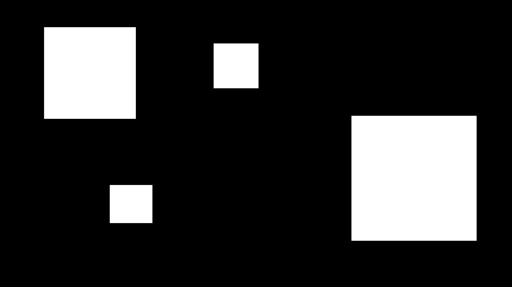
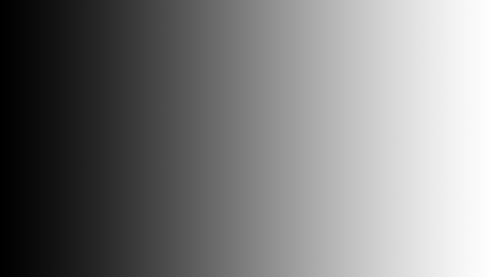

# pixel-sorter

[](https://ko-fi.com/P5P542WTU)

[](https://www.npmjs.com/package/@rusticflare/pixel-sorter)
[](LICENSE.md)
[](https://github.com/sponsors/RusticFlare)

A command line app for pixel sorting images

If you need help, find bugs, or want a new feature:
please [raise an issue](https://github.com/RusticFlare/pixel-sorter/issues/new)

_Inspired by [satyarth/pixelsort](https://github.com/satyarth/pixelsort/)_

## Installation

### Prerequisites

npm

- [Install npm](https://www.npmjs.com/get-npm).
- You are downloading the command line client that lets you install `pixel-sorter` from the npm repository

### Install (and Update) `pixel-sorter`

```shell
npm i -g @rusticflare/pixel-sorter
```

### Distro Packages

#### AUR (Arch Linux)

`pixel-sorter` can be installed from the [AUR](https://aur.archlinux.org/packages/pixel-sorter) using an [AUR helper](https://wiki.archlinux.org/title/AUR_helpers). e.g.

```shell
paru -S pixel-sorter
```

## Usage

### Pixel Sort Your First Image

This will pixel sort an image called `example.jpg` in your current directory and save the output in the same directory
as `example.jpg`.

```shell
pixel-sorter example.jpg
```

**Note:** A one pixel border is cropped from the output file (this is due to this pixel sorter making some of those
outer pixels slightly transparent)

<details><summary>Troubleshooting</summary>

- **Powershell**
    - Make sure you are running as an _Administrator_
    - If you see this error:
      ```shell
      ... cannot be loaded because the execution of scripts is disabled on this system.
      ```
      run:
      ```shell
      Set-ExecutionPolicy RemoteSigned
      ```
      ([See this StackOverflow answer for more details](https://stackoverflow.com/a/4038991))

</details>

### Options

_See [Examples](#examples) for how to use these_

|Option|Argument|Description|Default Value|
|---|---|---|---|
|`-p`|[A pattern](#patterns)|The patterns to sort along|`lines`|
|`-o`|Text|The name of the output file (e.g. `sorted`)|The current date and time|
|`-m`|File|The path to "mask" file|N/A|
|`-f`|File|The path to a file to be used by the `randomfile` interval function|N/A|
|`-a`|A number in `0.0`-`360.0`|The angle to sort along (as degrees on a compass)|`0.0`|
|`-i`|[An interval function](#interval-functions)|The interval function to use|`lightness`|
|`-l`|A number in `0.0`-`1.0`|The darkest `lightness` to include in sorted sections (used when the interval function is `lightness`)|`0.25`|
|`-u`|A number in `0.0`-`1.0`|The brightest `lightness` to include in sorted sections (used when the interval function is `lightness`)|`0.8`|
|`-w`|A positive whole number|The average width (in pixels) of the `random[file]` sorted sections (used when the interval function is `random[file]`)|`400`|
|`-s`|[A sorting function](#sorting-functions)|The sorting function to use|`lightness`|
|`-e`|[A filetype](#filetypes)|The extension of the filetype to output|`jpg`|
|`-c`|A pair of integers|The center of the circle when the `circles` pattern is used|`0 0`|
|`-r`|N/A|Reverse the sorting order|N/A|
|`-h`|N/A|Print the help message|N/A|

#### Patterns

- `lines`
- `circles`

#### Interval Functions

- `lightness` - pixels with a `lightness` between the `-l` and `-u` values are sorted
- `random` - random sections of average width `-w` are sorted
- `randomfile` - the brighter a pixel in a file provided by `-f` makes a pixel more likely to be sorted (use `-w` to
  control the average width)
- `none` - everything is sorted

#### Sorting Functions

- `hue`
- `saturation`
- `lightness`
- `intensity`

#### Filetypes

- `jpg`
- `png`

## Examples

`example.jpg`:


### Default

```shell
pixel-sorter example.jpg
```


### Threshold

When using the `lightness` interval function: only pixels with a `lightness` between `-l` and `-u` will be sorted.

Here we sort pixels with a `lightness` between 0.6 and 0.9:

```shell
pixel-sorter example.jpg -l 0.6 -u 0.9
```


### Angle 🧭

You can change the sorting angle (as degrees on a compass).

```shell
pixel-sorter example.jpg -a 315
```


### Circles 🟣

Sort circles with:

- center `-200 -600` (`0 0` is the center of the image)
- angle `210` (where the brightest and darkest pixels meet)
- reversed sort

```shell
pixel-sorter example.jpg -p circles -c -200 -600 -a 210 -r
```


### Mask & Random 🎭

A "mask" file should be a black and white image (the same size as the sorted image). Only the white sections are
considered for sorting.

`-i random` causes random sections of the image should be sorted. You can control the average width (in pixels) of these
sections with `-w`.

`example-mask.jpg`:



```shell
pixel-sorter example.jpg -m example-mask.jpg -a 135 -i random
```


### Random File

The brighter the pixel in `-f` the more likely the corresponding pixel is to be sorted.

`example-randomfile-mask.jpg`:



```shell
pixel-sorter example.jpg -i randomfile -f example-randomfile-mask.jpg
```


[](https://ko-fi.com/P5P542WTU)
